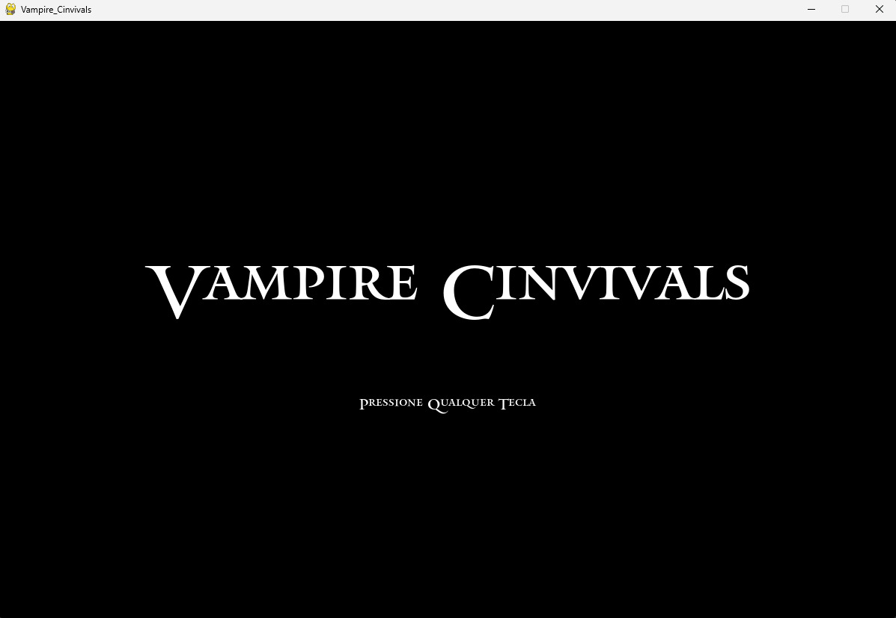
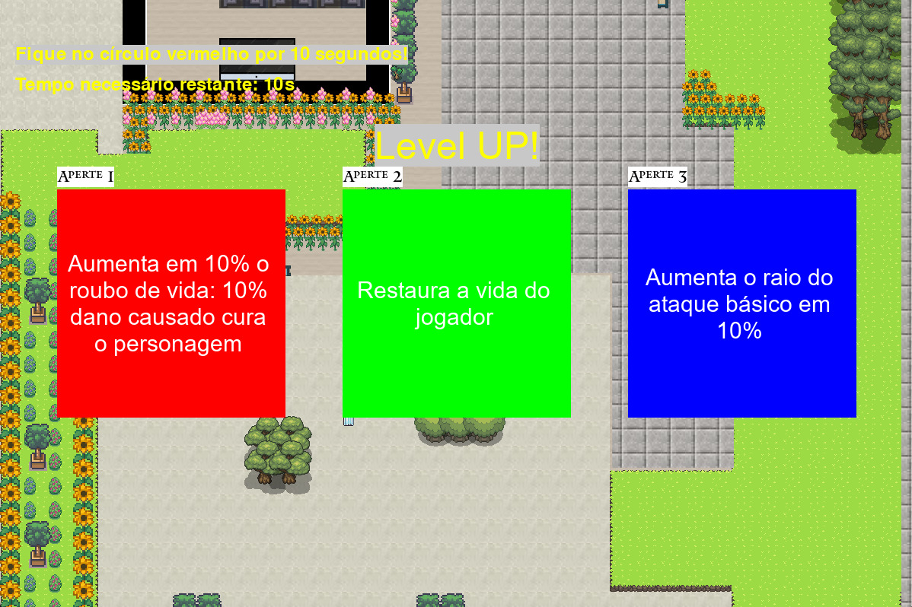
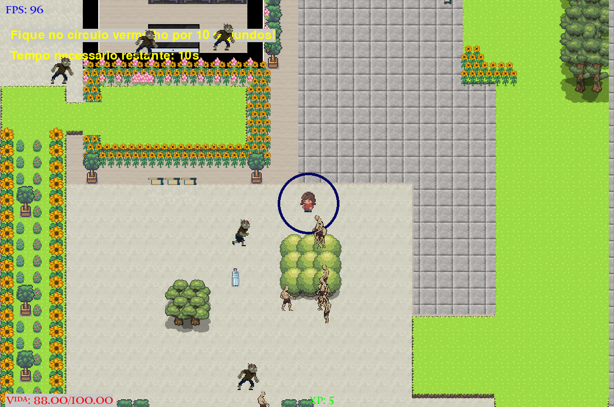
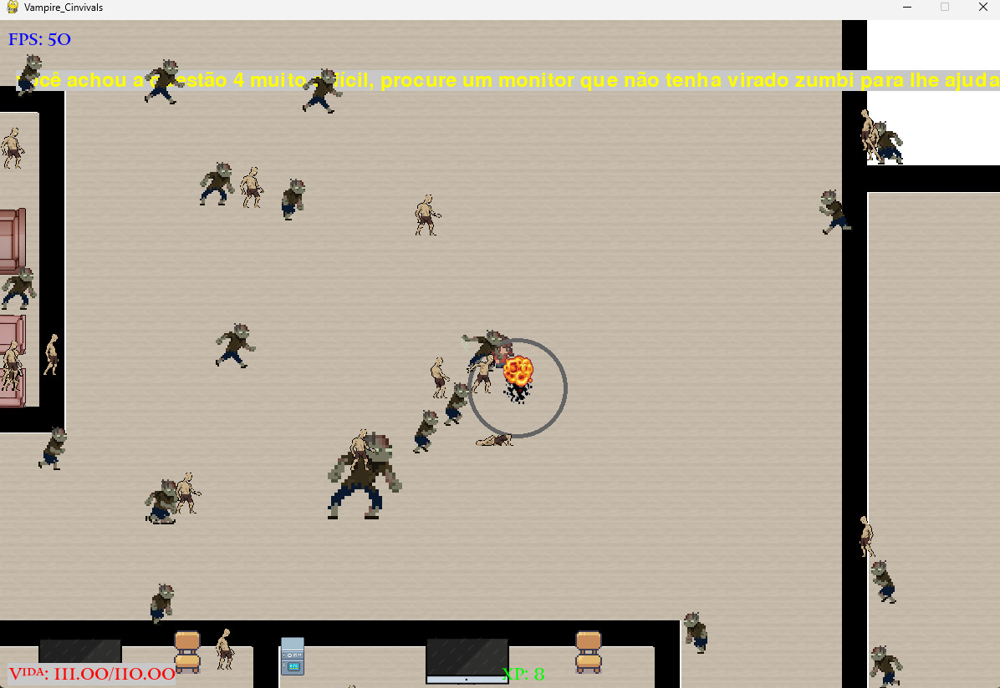
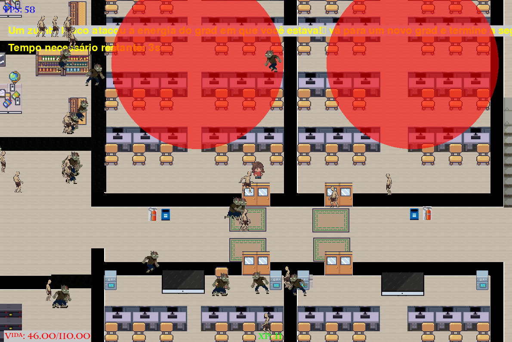

# Projeto CIN0001
## Vampire Cinvivals
Jogo do projeto final da cadeira de IP (Introdução a programação) do Centro de Informática da UFPE
## Integrantes
- Bruno Antônio
- Durin Fernandes
- Erick Barros
- Erick Vinícius
- Ivison Rafael
- Marcos Antônio

## Descrição e arquitetura do projeto
**Descrição**

A lore do jogo se baseia em uma aluna do cin que tem que entregar a lista de IP o mais rápido possível, pois, o prazo está curto, só que quando ela chega no CIN se depara com inúmeros zumbies, sim, é um apocalípse Zumbi. Com isso ela deve resolver a lista enquanto foge/luta contra os zumbies

**Arquiterura** 

O código foi organizado seguindo as normas de POO, sendo organizado em classes, e seguindo o conceito de modulariação, tal que classes similares ou de mesmo propósito geral são colacados no mesmo arquivo.py

- Enemies.py: Contém a classe Enemy (os inimigos)
- fases.py: Classe que gerencia as fases
- Weapons.py: Contém as classes da Armas (Crachá e garrafa)
- PlayerCharacter.py: Contém a class player
- main.py: Contém as lógicas do jogo
Esses são os arquivos principais

## Imagens
**Tela inicial**

**Level UP**

**Telas do Jogo**

## Bibliotecas
- Pygame: Biblioteca para a criação de jogos
- Math: Biblioteca com funções matemáticas, a usamos para auxiliar nos cálculos
- Time: Para gerenciar o controle do tempo ao decorrer do jogo, pois certas função são temporais

## Ferramentas
- Vscode: Editor de código
- Git e Github: Gerenciamento e versionamente do código.
- Tiled: Para criação das texturas e mapa.
## Divisão das Ativades
- Objetos Gráficos (Mapa, skins, objetos): Erick Barros, Marcos Amorim
- Gerenciamente de fases e a criação delas: Bruno
- Criação das armas e suas funcionalidades: Ivison Rafael
- Criação e mecânica do Boss: Durian Fernandes
- Mecânica geral do jogo (Renderização do map, movimentação, e a class eminies): Erick Vinícios

## Conceitos Aplicadados
Além da programação orientada a objetos.
- Estruturas condicionais: Foi, principalmente, utilazadas nos ataques que só eram acionados em uma certa distância.
- Estruturas de repetição: Basicamente, o jogo é um loop, mas outros casos de uso são, na análise de eventos do pygame, além de sempre usar repetição para pecorrer, quando necessário, listas.
- Listas: Lista foi a estrutura de dados mais utilizada no código, Exemplos de listas no código são, a lista que armazena as garrafas, a lista que contém as armas, a lista que contém as armas ativas e afins.
- Diciónários e tuplas: Usamos Diciónarios, principalmente, nas instâncias das classes armas e no level_up.
- Funções: Resumidamente, todos os métodos das classes.

## Qual foi o maior erro cometido durante o projeto? Como vocês lidaram com ele?
Tentar fazer o mais perfeito e completo possível, o que acabou acarretando em um pequeno atraso no avançar do desenvolvimento. Mas isso foi contornado com reuniões, uma troca de ideias constante entre a equipe e consenso de todas as partes.
## Qual foi o maior desafio enfrentado durante o projeto? Como vocês lidaram com ele?
Implementar as ideias do planejamento inicial e adaptar-se às novas ideais que tiveram que ser alteradas ao longo do percurso foi crucial para avançar com o projeto. Inicialmente, a falta de um rumo claro prejudicou nosso progresso. Já que muitas das funcionalidades precisavam ser aprendidas em curto espaço de tempo, no caso o Pygame e POO. Para resolver isso, promovemos discussões frequentes entre a equipe para avaliar ideias viáveis e interessantes. Além disso, atribuímos responsabilidades com base nas habilidades individuais, um aspecto que não havia sido previamente discutido, e isso impulsionou significativamente o desenvolvimento de todas as aplicações. 
## Quais as lições aprendidas durante o projeto?
**Trabalho em equipe**: Algo que esse projeto nos ensinou  foi a importância do trabalho em equipe, de estar constantemente ajudando um ao outro durante o percurso do projeto. Sem dúvidas sem isso o projeto não teria caminhado como deveria. Gerenciamento de tempo: Vale ressaltar que saber como gerenciar o tempo foi algo crucial, já que além desse projeto, tínhamos ao mesmo tempo que equilibrar com projetos e atividades paralelos a esse. 

**Persistência**: por mais que parecesse difícil a implementação de certos recursos dentro do desenvolvimento, continuamos até o ultimo minuto, até que não houvesse brechas e o projeto ficasse o mais completo possível.
